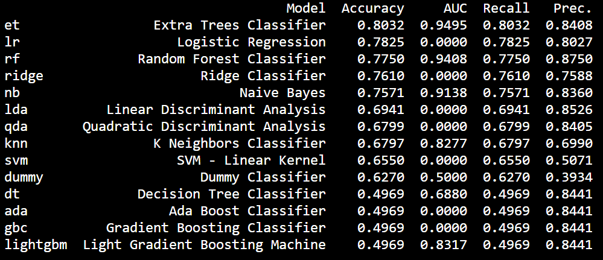
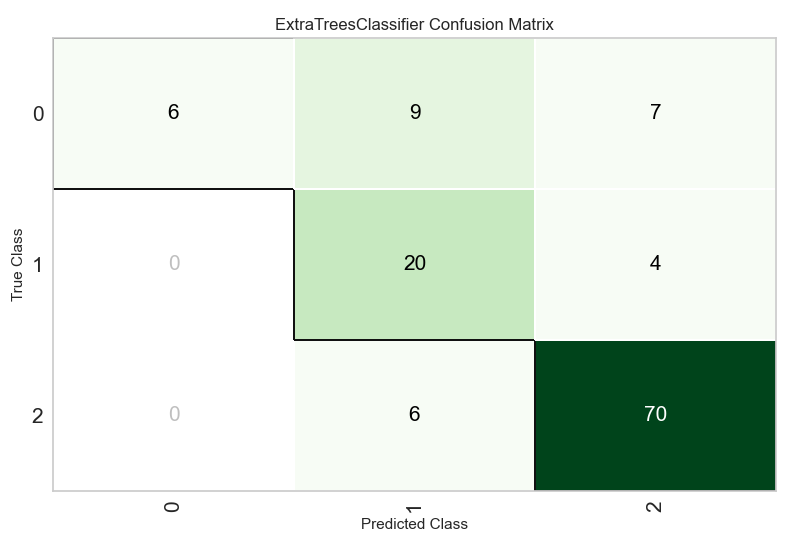
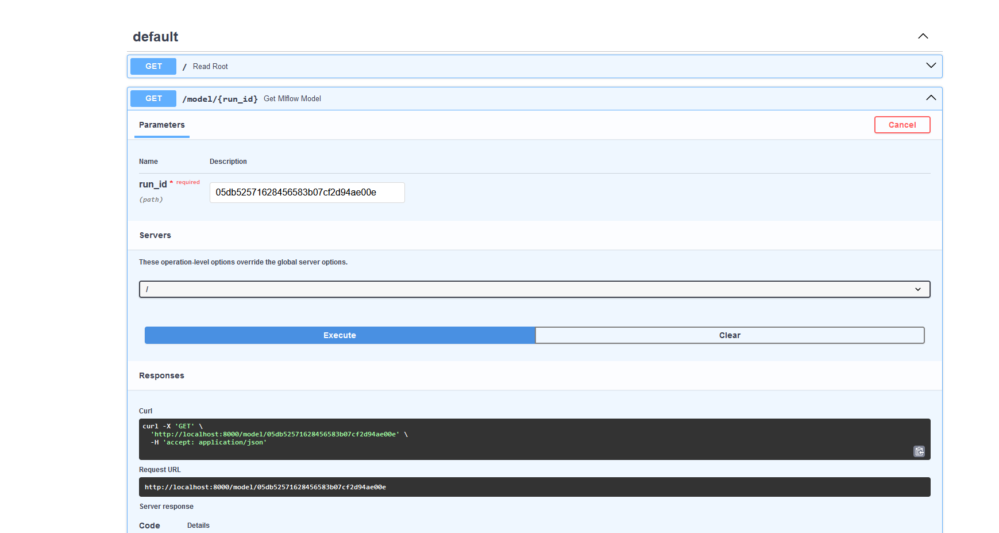

# Ops óra anyaga

## Felkészülés
EZT AKKOR HA MEGVAN AZ ANYAG!!!

Szükséges:
- python verzió (3.11.8)
- IDE: [VSCode](https://developer.skao.int/en/latest/howto/docker-vscode.html)/[Pycharm](https://www.jetbrains.com/help/pycharm/docker.html#install_docker)
- [Git](https://git-scm.com/download/win)
- [rabbitmq](https://www.rabbitmq.com/docs/install-windows) 


## Projekt másolása


## VSCode setup
Készítsünk egy virtuális környezetet.

Aki még nem tette, tegye fel a pandas-t és a numpy-t. Ha vscode-ot használnak a balfelső sarokban található egy terminál nevü fül, ahol megnyithatunk egy

Teszt...

Ha nem működik, lehetséges, hogy nem az aktuális virtuális környezet van megnyitva...

Kiegészítők a vscodehoz:
 - Data Viewer / data wrangler
 - Error lens
 - yaml

Ezt látjuk ha az errorlenst beütjük az extensions-höz (3 + 1 kocka ikon az oldalmenün):


Data wrangler az adatok vizsgálatához:


### Virtuális környezet felállítása

```
pip install -r requirements.txt
```
A szükséges csomagok a *requirements.txt* fájlban megtalálhatók, később lesz róla szó, hogyan exportálhatjuk egyszerűen! 

### Adatbeolvasás

A könyvtárban található cars.csv adatsorral dolgozunk.
Hozzunk létre *model.py* nevű fájlt. Töltsük be az adatokat:

```python
import pandas as pd
data = pd.read_csv("./data/cars.csv", sep=";")
```


## Pycaret

A pycaret egy end-to-end machine learning model csomag, mely képes az adatok előfeldolgozására, legjobb model kiválasztására, és ennek alkalmazására. Low code megközelítése, így gyorsan el lehet vele végezni rutin feladatokat. Minden fontos lépés elvégzésére képes:


Kép a Pycaret oldaláról.


### Klasszifikáció

Mintakódot [itt](https://pycaret.gitbook.io/docs/get-started/quickstart#classification) találnak.

Folytassuk az *model.py* írását. Az importokhoz írjuk, hogy:
```python
from pycaret.classification import *
```

Majd folytassuk a kódolást az adatbeolvasás után:

```python
s = setup(data, target = "Origin")
```

És készítsünk egy model összehasonlítást:
```python
best = compare_models()
```

Ha futtatjuk a következő eredmény kapjuk a terminálba:



A -best- változóval megkapjuk a modelt, amit később predikáláshoz használhatunk. Az "et" Extra trees classifier, ami több decision tree-t tanít be, az összes adaton.

Írjuk a kódhoz, hogy:

```python
plot_model(best, plot = 'confusion_matrix')
```
Melynek eredménye:



Nézzük meg, lehet-e ezzel predikálni. Használjuk a data változóra a *prediction* függvényt:

```python
predictions = predict_model(best, data=data, raw_score=True)
```

Később fontos lesz, hogy ki tudjunk menteni, és be tudjunk tölteni bizonyos modelleket. Ezért nézzük meg, hogy működnek-e ezek a funckiók!

```python
save_model(best, 'my_best_pipeline')
```

```python
loaded_model = load_model('my_best_pipeline')
```
Ha minden jól ment, akkor megjelenik egy *my_best_pipeline.pkl* nevű fájl a könyvtárunkban.

Megjegyzés: Ahhoz hogy a modelt be lehessen tölteni, a kísérletet is be kell tölteni! Ez kimenthető a "save_experiment" függvénnyel, és betölthető a "load_experiment" függvénnyel.

## MLflow

Az MLflow egy [MLops](https://ml-ops.org/) csomag a python gépi tanulási környezethez. Széleskörben használt, főbb céljai a lefuttatott modellek elmentése ("loggolása"), és eltárolása. Négy főbb funkciót lát el:


Melyből jelenleg az MLflow Trackinget fogjuk használni. Ez elmenti a futtatást egy központi szerverre, majd ad neki egy git-szerű ID-t. Ez egy __run__. A __run__-okat egy __Experiment__ tömöríti. Érdemes ezt adatsorokhoz kötni, így az __Experiment__ objektumban az inputok, és outputok hasonlóak lesznek, de ez __NEM__ egy szabály! Az MLProject még fontos funkciót ad. Becsomagolja egy olyan formátumba a modellünket, amiből egyszerűen tudunk telepíteni, és használni modelleket. 

Indítsunk el egy lokális szervert, ami nyomon követi a modelltanítási tevékenységünket:

```
mlflow server
```
Hirtelen megjelenik majd a könyvtárunkban az *mlruns* nevű mappa, itt találhatóak majd a különböző futtatások eredményei.
Általában a következő linkkel nyitható meg a User Interface:
http://127.0.0.1:5000

A kísérletünket a "setup" függvény módosításával trackelhetjük:
```python
s = setup(data, target = "Origin", log_experiment = True, experiment_name = 'cars')
```
Ha elnavigálunk az mlflow UI-ja, a következőt látjuk:


https://towardsdatascience.com/easy-mlops-with-pycaret-mlflow-7fbcbf1e38c6

### Hogyan töltünk be elmentett modelleket?

A betöltést egy külön fájlban fejlezstjük - nem akarjuk hogy mindig újratanítson, pont elég ha a modelt töltjük be!
Mivel a másik terminálban már a szerver fut, ezért új terminált kell nyitni.

Amint létrehoztuk *load_model.py* fájlt, 


## FastAPI és uvicorn
A FastAPI egy RestAPI-t követő csomag API-ok létrehozásához. A uvicorn egy backendet futtató, Flasken alapuló csomag, amivek könnyen tudjuk futtatni a FastAPI által létrehozott API-t.

Egy gyors hello world alkalmazás egy API felállításához. 

```python

from fastapi import FastAPI, Request, BackgroundTasks
import mlflow


app = FastAPI()

@app.get("/") 
async def read_root():
    """Default path. See /docs for more."""
    return "Hello World"
    ## TODO:


if __name__ == "__main__":
    import uvicorn
    uvicorn.run("back_end:app", host="localhost", port=8000, reload=True)
```
Ha navigálunk az általunk megadott IP-címre:


FastAPI-nak van egy "docs" nevű oldala, amit a következő linken érünk el:

```
http://localhost:8000/docs
```

Ezt nézze meg mindenki magának!

A rendszert bővíthetjük úgy hogy ha ránavigálunk egy linkre, akkor betöltse az adott mlflow modelt. Először  írjuk meg az API parancsot:

```python
model = None
@app.post("/model/{run_id}") ## API decortar
def get_mlflow_model(run_id): # run_id of the run we want to load in - see load_model.py
    global model
    model =  mlflow.sklearn.load_model(f"runs:/{run_id}//model")

```

Ez önmagában nem fog működni, ugyanis a FastAPI-nak szüksege van a mlflow uré-jére hogy tudjon vele kommunikálni. Egy lifespan függvény fogunk definiálni, ami a szervel felállításánál és leállításánál meghívódik:

```python
from contextlib import asynccontextmanager # to the imports
...
@asynccontextmanager # soon after imports
async def lifespan(app: FastAPI):
    # at start
    mlflow.set_tracking_uri("http://127.0.0.1:5000")
    yield
    # at stop
    return
# after asnyccontextmanager
app = FastAPI(lifespan=lifespan)
...
# here comes API commands and if __main__ ...

```

Hogy használni tudjuk a modellünket, szükségünk van a model "predict" függvényének megírásához. Ez azt jelenti, hogy post API-t írunk, egy request-tel - Ez egy olyan objektum, amivel el tudjuk küldeni az API-nknak az adatot.

```python
import pandas as pd


...


```


### Virtuális környezet exportálása
```
pipreqs ./
```

HA .venv mappa megtalálható, akkor nem fog működni -> Tegyük bele egy külön mappába, és azt adjuk meg elérési útként.