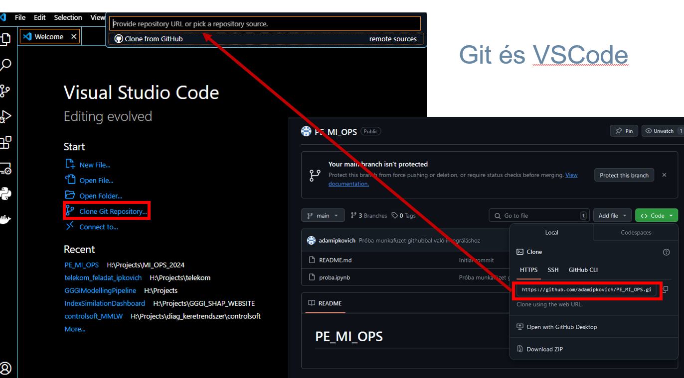
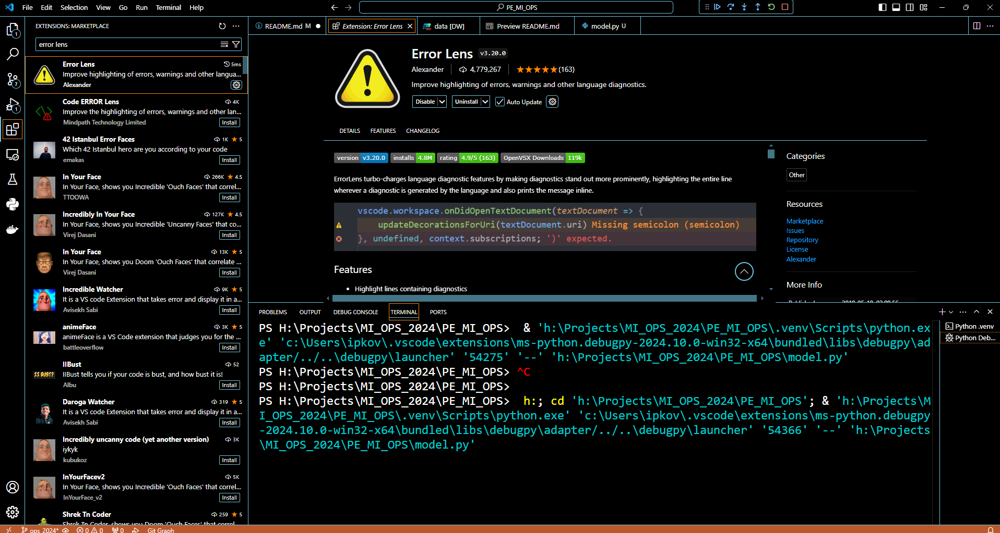
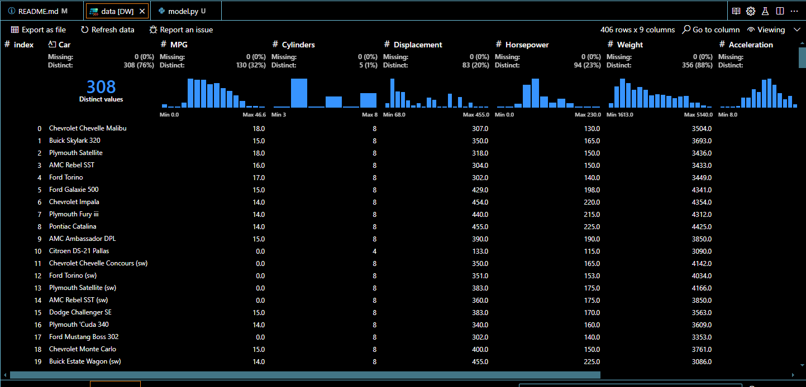
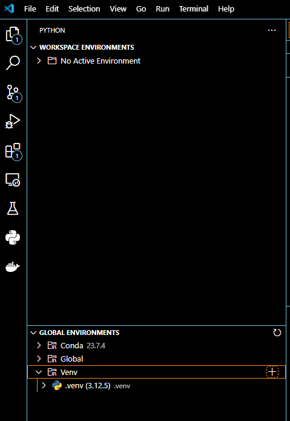

# Ops óra anyaga

## Felkészülés

Szükséges:
- python verzió (3.11.8, 3.12.5)
- IDE: [VSCode](https://developer.skao.int/en/latest/howto/docker-vscode.html)/[Pycharm](https://www.jetbrains.com/help/pycharm/docker.html#install_docker)
- [Git](https://git-scm.com/download/win)
- [rabbitmq](https://www.svix.com/resources/guides/rabbitmq-windows-install-guide/) 
- Github fehasználó!


## Projekt másolása




## VSCode setup

Kiegészítők a vscodehoz:
 - Data Viewer / data wrangler
 - Error lens
 - yaml

Ezt látjuk ha az errorlenst beütjük az extensions-höz (3 + 1 kocka ikon az oldalmenün):


Data wrangler az adatok vizsgálatához:


### Virtuális környezet felállítása

Kattintsunk az ábrán jelölt + ikonra.



Felül megjelenik egy panel, ahol kiválaszthatjuk a Python-t, illetve hogy használunk-e requirements.txt-t. Itt ki vannak mentve a szükséges csomagok.
Ha az utóbbit nem sikerül kiválasztani, akkor a következővel tudjuk telepíteni:
```
pip install -r requirements.txt
```

A szükséges csomagok a *requirements.txt* fájlban megtalálhatók, később lesz róla szó, hogyan exportálhatjuk egyszerűen! 


### Adatbeolvasás

A könyvtárban található cars.csv adatsorral dolgozunk.
Hozzunk létre *model.py* nevű fájlt. Töltsük be az adatokat:

```python
import pandas as pd
data = pd.read_csv("./data/cars.csv", sep=";")
```


## Modelezés

A következő projekt adott. Vannak autóink specifikus országokra tervezve, és ezeknek az autókna van számos változója. Ebből akarjuk megmondani, hogy az adott modellt hova tervezték. Megkeressük a lehető legjobb döntési fát GridSearch segítségével, majd predikálunk vele, hogy megnézzük működik-e a predikció. 

A kód a következő:

```python
import numpy as np
import pandas as pd

from sklearn.tree import DecisionTreeClassifier
from sklearn.model_selection import  GridSearchCV

#%% Load data
data = pd.read_csv("./data/cars.csv", sep=";")

ind = data["Car"]
y = data["Origin"]
X = data.drop(columns=["Origin", "Car"])

hyper_params ={'criterion': ['gini', 'entropy', 'log_loss'],
                        'ccp_alpha': [0.1, 0.01, 0.001],
                        'max_depth': np.arange(2, 10, 1), }


#%% Train with gridsearch...

clf = GridSearchCV(DecisionTreeClassifier(), hyper_params, cv=5)
clf.fit(X, y) # train the model
model = clf.best_estimator_
score = clf.best_score_
y_hat = clf.predict(X)
```

## MLflow

Az MLflow egy [MLops](https://ml-ops.org/) csomag a python gépi tanulási környezethez. Széleskörben használt, főbb céljai a lefuttatott modellek elmentése ("loggolása"), és eltárolása. Négy főbb funkciót lát el:


Melyből jelenleg az MLflow Trackinget fogjuk használni. Ez elmenti a futtatást egy központi szerverre, majd ad neki egy git-szerű ID-t. Ez egy __run__. A __run__-okat egy __Experiment__ tömöríti. Érdemes ezt adatsorokhoz kötni, így az __Experiment__ objektumban az inputok, és outputok hasonlóak lesznek, de ez __NEM__ egy szabály! Az MLProject még fontos funkciót ad. Becsomagolja egy olyan formátumba a modellünket, amiből egyszerűen tudunk telepíteni, és használni modelleket. 

Indítsunk el egy lokális szervert, ami nyomon követi a modelltanítási tevékenységünket:

```
mlflow server
```
Hirtelen megjelenik majd a könyvtárunkban az *mlruns* nevű mappa, itt találhatóak majd a különböző futtatások eredményei.
Általában a következő linkkel nyitható meg a User Interface:
http://127.0.0.1:5000

A *model.py* kódunkat a mlflow csomagjának segítségével kibővítjük, hogy lementse az modelt, és az inputok nevét.

```python
import numpy as np
import pandas as pd

from sklearn.tree import DecisionTreeClassifier
from sklearn.model_selection import  GridSearchCV

import mlflow
from mlflow.tracking import MlflowClient
import mlflow.sklearn


#%% Load data
data = pd.read_csv("./data/cars.csv", sep=";")

ind = data["Car"]
y = data["Origin"]
X = data.drop(columns=["Origin", "Car"])

hyper_params ={'criterion': ['gini', 'entropy', 'log_loss'],
                        'ccp_alpha': [0.1, 0.01, 0.001],
                        'max_depth': np.arange(2, 10, 1), }


#%% Train with gridsearch...

clf = GridSearchCV(DecisionTreeClassifier(), hyper_params, cv=5)
clf.fit(X, y) # train the model
model = clf.best_estimator_
score = clf.best_score_
y_hat = clf.predict(X)
#cm = confusion_matrix(y, y_hat, normalize='true')

#%% Save with Mlflow
mlflow.set_tracking_uri("http://127.0.0.1:5000") # To which server to upload
client = MlflowClient("http://127.0.0.1:5000") 
name = "cars" 
try:
        client.create_experiment(name)
except Exception as e:
            pass   
experiment_id = client.get_experiment_by_name(name).experiment_id

with mlflow.start_run(experiment_id=experiment_id):
    run_id = mlflow.active_run().info.run_id
    mlflow.sklearn.log_model(model, "model")
    mlflow.log_param("input", X.columns.to_list())
    

```

Ha elnavigálunk az mlflow UI-ja, a következőt látjuk:


### Hogyan töltünk be elmentett modelleket?

A betöltést egy külön fájlban fejlezstjük - nem akarjuk hogy mindig újratanítson, pont elég ha a modelt töltjük be!
Mivel a másik terminálban már a szerver fut, ezért új terminált kell nyitni.

Amint létrehoztuk *load_model.py* fájlt, ezt írjuk bele:

```python
import mlflow
import pandas as pd


mlflow.set_tracking_uri("http://127.0.0.1:5000") # must have!
run_id = "4351d55a1fbc445e968b8c573cf5f1be" # run id of a given model
model =  mlflow.sklearn.load_model(f"runs:/{run_id}//model") ## sklearn model's load
data = pd.read_csv("./data/cars.csv", sep=";") ## reread data
client = mlflow.tracking.MlflowClient(tracking_uri="http://127.0.0.1:5000") # get info
run_data_dict = client.get_run(run_id).data.to_dictionary() # get input names

print(model.predict(data.drop(columns=["Origin", "Car"])))
```
Ezzel a módszerrel betöltjük az mlflow-ról a modelt.
## FastAPI és RabbitMQ 
A FastAPI egy RestAPI-t követő csomag API-ok létrehozásához. A uvicorn egy backendet futtató, Flasken alapuló csomag, amivek könnyen tudjuk futtatni a FastAPI által létrehozott API-t.

Egy gyors hello world alkalmazás egy API felállításához. 

```python

from fastapi import FastAPI, Request, BackgroundTasks
import mlflow


app = FastAPI()

@app.get("/") 
async def read_root():
    """Default path. See /docs for more."""
    return "Hello World"
    ## TODO:


if __name__ == "__main__":
    import uvicorn
    uvicorn.run("back_end:app", host="localhost", port=8000, reload=True)
```
Ha navigálunk az általunk megadott IP-címre:


FastAPI-nak van egy "docs" nevű oldala, amit a következő linken érünk el:

```
http://localhost:8000/docs
```

Ezt nézze meg mindenki magának!

A rendszert bővíthetjük úgy hogy ha postolunk egy parancsot, akkor akkor betöltse az adott mlflow modelt. 

```python
model = None
@app.post("/model/{run_id}") ## API decortar
def get_mlflow_model(run_id): # run_id of the run we want to load in - see load_model.py
    global model
    model =  mlflow.sklearn.load_model(f"runs:/{run_id}//model")

```

Ez önmagában nem fog működni, ugyanis a FastAPI-nak szüksege van a mlflow url-jére hogy tudjon vele kommunikálni. Egy lifespan függvényt fogunk definiálni, ami a szerver felállításánál és leállításánál meghívódik:

```python
from contextlib import asynccontextmanager # to the imports
...
@asynccontextmanager # soon after imports
async def lifespan(app: FastAPI):
    # at start
    mlflow.set_tracking_uri("http://127.0.0.1:5000")
    yield
    # at stop
    return
# after asnyccontextmanager
app = FastAPI(lifespan=lifespan)
...
# here comes API commands and if __main__ ...

```
Késöbb hozzáadhatjuk, hogy a lementett input neveket is betöltsük. A teljes kód így néz ki:

```python
## FastAPI
from contextlib import asynccontextmanager
from fastapi import FastAPI, Request
import mlflow
import mlflow.sklearn
import pandas as pd

model = None
client = None
signature = None
@asynccontextmanager
async def lifespan(app: FastAPI):
    global client
    client = mlflow.tracking.MlflowClient(tracking_uri="http://127.0.0.1:5000")
    yield
    return

app = FastAPI(lifespan=lifespan)

@app.get("/") 
async def read_root():
    """Default path. See /docs for more."""
    return "Hello World"

@app.get("/model/{run_id}")
def get_mlflow_model(run_id : str):
    """Loads a model from the tracking server, by run_id"""
    global model, client, signature
    mlflow.set_tracking_uri("http://127.0.0.1:5000")
    model =  mlflow.sklearn.load_model(f"runs:/{run_id}//model")
    run_data_dict = client.get_run(run_id).data.to_dictionary()
    print(run_data_dict)
    signature = eval(run_data_dict["params"]["input"])


if __name__ == "__main__":
    import uvicorn
    uvicorn.run("back_end:app", host="localhost", port=8000, reload=True)

```

Ahhoz, hogy meg tudjuk hívni, és tesztelni tudjuk a kódot kell kliensoldali kód. Ezt a request csomaggal készíthetjük el.

Hozzuk létre a *commands.py* scriptet, és írjuk bele a következőt:

```python
import requests

if __name__ == "__main__":
    url = "http://localhost:8000"
    run_id = "781fd38f7a0b4ef0a7e562b11eacf8e2" # your mlflow run_id please
    resp = requests.get(url + "/model/" + run_id)    
```
Ezzel be tudjuk tölteni a szerverünknél a modelt az MLflowból.


Hogy használni tudjuk a modellünket, szükségünk van adatokra, és adatok átadására. A FastAPI képes post requestekkel adatot fogadni, ugyanakkor ez nagy adathalmaznál már nem hatékony. Ezért egy brókerrendszert alkalmazunk, hogy skálázható legyen a programunk. Ez lesz a RabbitMQ. A Rabbit feladókkel (producer), fogyasztókkal (consumer) és sorokkal (queue) dolgozik alapszinten. A feladó küld egy üzenetet, (ami a mi esetünkben tartalmazza majd az adatokat) a sorba, ami eljuttatja a fogyasztónak a messaget, ahol várakozik (megfelelő beállítással), amíg vissza nem jelez a fogyasztó, hogy megkapta. Ahhoz, hogy csatlakozzunk a rabbitMQ szolgáltatáshoz, először telepítjük a megfelelő csomagot:

```
pip install pika
```

Majd indulásnál a következő kódsort használjuk:


```python
import pika
rabbit_connection = None
channel = None
@asynccontextmanager
async def lifespan(app: FastAPI):
    global client, rabbit_connection, channel
    client = mlflow.tracking.MlflowClient(tracking_uri="http://127.0.0.1:5000")
    credentials = pika.PlainCredentials(username="guest", password="guest")
    while rabbit_connection is None:
        try:
            rabbit_connection = pika.BlockingConnection(pika.ConnectionParameters(host = "localhost", port = 5672, credentials=credentials, heartbeat=0))
        except pika.exceptions.AMQPConnectionError:
            logging.error(f"Connection to RabbitMQ failed at localhost:5672. Retrying...")
            time.sleep(0.3)
    channel = rabbit_connection.channel()
    channel.basic_qos(prefetch_count=1)
    yield
    channel.close()
    rabbit_connection.close()
    return
```
Ez a kód indulásnál már csatlakozik a Rabbit szolgáltatáshoz, így nekünk már nem kell törődni vele.

A feladó kódját külön definiáljuk, ez egy kliensoldali alkalmazás lesz:
```python
def post_data(data, queue_name, host = "localhost", port = 5672, user = "guest", password = "guest"):
    connection = pika.BlockingConnection(pika.ConnectionParameters(host=host, port=port, credentials=pika.PlainCredentials(user, password)))
    channel = connection.channel()
    channel.queue_declare(queue=queue_name, durable=True)
    channel.basic_publish(exchange='', routing_key=queue_name, body=data.encode('utf-8'))
    connection.close()

```

Connection, channel, publish, queue declare, etc magyarázása...

Ezután készítünk egy get command URL-t a predikcióhoz:
```python

@app.get("/predict/{queue}")
async def predict(queue):
    global channel
    method_frame, header_frame, body = channel.basic_get(queue)
    data = body.decode("utf-8")
    channel.basic_ack(method_frame.delivery_tag)
    data = pd.read_json(data)
    return pd.DataFrame(model.predict(data.loc[:, signature])).to_json() 

```

Végül a kód így néz ki:

```python
## FastAPI
from contextlib import asynccontextmanager
from fastapi import FastAPI, Request
import mlflow
import mlflow.sklearn
import pandas as pd
import pika
import time
import logging

model = None
client = None
signature = None
rabbit_connection = None
channel = None
@asynccontextmanager
async def lifespan(app: FastAPI):
    global client, rabbit_connection, channel
    client = mlflow.tracking.MlflowClient(tracking_uri="http://127.0.0.1:5000")
    credentials = pika.PlainCredentials(username="guest", password="guest")
    while rabbit_connection is None:
        try:
            rabbit_connection = pika.BlockingConnection(pika.ConnectionParameters(host = "localhost", port = 5672, credentials=credentials, heartbeat=0))
        except pika.exceptions.AMQPConnectionError:
            logging.error(f"Connection to RabbitMQ failed at localhost:5672. Retrying...")
            time.sleep(0.3)
    channel = rabbit_connection.channel()
    channel.basic_qos(prefetch_count=1)
                
    yield
    channel.close()
    rabbit_connection.close()
    return

app = FastAPI(lifespan=lifespan)

@app.get("/") 
async def read_root():
    """Default path. See /docs for more."""
    return "Hello World"
    ## TODO:

@app.get("/model/{run_id}")
def get_mlflow_model(run_id : str):
    global model, client, signature
    mlflow.set_tracking_uri("http://127.0.0.1:5000")
    model =  mlflow.sklearn.load_model(f"runs:/{run_id}//model")
    run_data_dict = client.get_run(run_id).data.to_dictionary()
    print(run_data_dict)
    signature = eval(run_data_dict["params"]["input"])
    return 

@app.get("/predict/{queue}")
async def predict(queue):
    global channel
    method_frame, header_frame, body = channel.basic_get(queue)
    data = body.decode("utf-8")
    channel.basic_ack(method_frame.delivery_tag)
    data = pd.read_json(data)

    y = model.predict(data.loc[:, signature])
    data["y_pred"] = y
    return data.to_json()

if __name__ == "__main__":
    import uvicorn
    uvicorn.run("back_end:app", host="localhost", port=8000, reload=True)
```

Ha a kliensoldali kódot kibővítjük, hogy meg tudjuk hívni az url-t, akkor a következőt kapjuk a *commands.py*-ben:

```python
import requests
import pandas as pd
import pika

def post_data(data, queue_name, host = "localhost", port = 5672, user = "guest", password = "guest"):
    connection = pika.BlockingConnection(pika.ConnectionParameters(host=host, port=port, credentials=pika.PlainCredentials(user, password)))
    channel = connection.channel()
    channel.queue_declare(queue=queue_name, durable=True)
    channel.basic_publish(exchange='', routing_key=queue_name, body=data.encode('utf-8'))
    connection.close()

if __name__ == "__main__":
    url = "http://localhost:8000"
    run_id = "781fd38f7a0b4ef0a7e562b11eacf8e2"
    resp = requests.get(url + "/model/" + run_id)    
    print(resp)

    data = pd.read_csv("./data/cars.csv", sep=";")
    post_data(data.to_json(), "cars")
    resp = requests.get(url + "/predict/cars" )
    
    ## send this to the frontend.
    
    print(resp.content)

```

## Frontend: streamlit

Frontend lényege, hogy egyszerűen tudjuk használni a Szerverünket, miközben minden funkcionalítást megtartunk. A frontend lecseréli majd a commands.py-t, ezen keresztül tudunk majd predikálni, és a visszakapott adatokat vizualizálni. Így nem kell lokálisan használnunk a modellünket, csökkentve az erőforrásigényt (ha a modell ki van szervezve.)

Készítsünk egy egyszerű szövegalapú oldalt, amit a [streamlit](https://docs.streamlit.io/) csomag segítségével egyszerűen megoldhatunk. A streamlit widgetekkel operál, melynek elhelyzését a scriptben sorban, instrukciók alapján teszi. Így előbb lesz a gomb az oldalon, ha szövegben a legelső sorban lesz, kivéve ha definiálunk oszlopokat, *etc*.

Az elemek beillesztése a rendszerbe egyszerű, ha importáljuk a streamlitet, akkor:

```python
import streamlit as st
if st.button("Click me"):
    st.write("You clicked me.")
else:
    st.write("You DID NOT click me!")
```

A script-et úgy indítjuk el, hogy:

```
streamlit run front_end.py
```


Itt sajnos, ha egyszer megnyomjuk a gombot, akkor úgy is marad. Ha azt akarjuk, hogy visszaállítsa a kiírást:

```python
import streamlit as st
import time 

#%% Simple interface
if st.button("Click me"):
    st.write("You clicked me.")
else:
    st.write("You DID NOT click me!")

time.sleep(1)
st.rerun() # Ez lefuttatja újra a frontendet, így tudunk trükközni.

```

A frontend célja, hogy lecseréljük a terminálon való kezelést, és vizualizáljunk. Ehhez az kell, be tudjuk tölteni a modellt, hogy fel tudjuk tölteni az adatot, ezt el tudjuk küldeni rabbitnak, fogadjuk az eredményt, majd a kapott eredményekre ábrát készítsünk.  


A modellbetöltéshet 2 elem kell: egy gomb és egy input panel:

```python
## Streamlit
import streamlit as st
import pandas as pd
import pika
import requests


#%% Simple interface

host = "localhost"
port = 5672
user = "guest"
password = "guest"
url = "http://localhost:8000"
upload = st.file_uploader("Upload CSV.")


run_id = st.text_input("Run ID")
if st.button("Load model"):
    resp = requests.get(url + "/model/" + run_id) 
    st.write(resp.content)
else:
    st.write("Click the button to load model.")
```

Szereljünk bele egy állapotjelzőt, hogy tudjuk van-e modell betöltve. Ehhez hozzányúlunk a *back_end.py*-hez is. Írjunk egy get-et, ahol lekérjük a run_id-t. Itt a betöltésnél lementjük, majd return-nel visszaadjuk. Így néz ki a backend módosítás után:

```python
from contextlib import asynccontextmanager
from fastapi import FastAPI, Request
import mlflow
import mlflow.sklearn
import pandas as pd
import pika
import time
import logging

model = None
client = None
signature = None
rabbit_connection = None
channel = None
current_run_id = None

@asynccontextmanager
async def lifespan(app: FastAPI):
    global client, rabbit_connection, channel
    client = mlflow.tracking.MlflowClient(tracking_uri="http://127.0.0.1:5000")
    credentials = pika.PlainCredentials(username="guest", password="guest")
    while rabbit_connection is None:
        try:
            rabbit_connection = pika.BlockingConnection(pika.ConnectionParameters(host = "localhost", port = 5672, credentials=credentials, heartbeat=0))
        except pika.exceptions.AMQPConnectionError:
            logging.error(f"Connection to RabbitMQ failed at localhost:5672. Retrying...")
            time.sleep(0.3)
    channel = rabbit_connection.channel()
    channel.basic_qos(prefetch_count=1)
                
    yield
    channel.close()
    rabbit_connection.close()
    return

app = FastAPI(lifespan=lifespan)

@app.get("/") 
async def read_root():
    """Default path. See /docs for more."""
    return "Hello World"
    ## TODO:

@app.get("/model/current")
def get_model_state():
    global current_run_id

    if current_run_id is None:
        return "No model is loaded"
    else:
        return current_run_id 

@app.get("/model/{run_id}")
def get_mlflow_model(run_id : str):
    global model, client, signature, current_run_id
    mlflow.set_tracking_uri("http://127.0.0.1:5000")
    model =  mlflow.sklearn.load_model(f"runs:/{run_id}//model")
    run_data_dict = client.get_run(run_id).data.to_dictionary()
    print(run_data_dict)
    signature = eval(run_data_dict["params"]["input"])
    current_run_id = run_id
    return f"Successfully loaded model {run_id}."

@app.get("/predict/{queue}")
async def predict(queue):
    global channel
    method_frame, header_frame, body = channel.basic_get(queue)
    data = body.decode("utf-8")
    channel.basic_ack(method_frame.delivery_tag)
    data = pd.read_json(data)
    y = model.predict(data.loc[:, signature])
    data["y_pred"] = y
    return data.to_json()


if __name__ == "__main__":
    import uvicorn
    uvicorn.run("back_end:app", host="localhost", port=8000, reload=True)
    

```
FONTOS: A kivételnek (/model/current) előrébb kell lennie a definícióban mint az általános megfogalmazás!

Állapotjelölő a frontendben úgy jön létre, ha a végére illesztjük:
```python
resp = requests.get(url + "/model/current") 
run_id = resp.content.decode("utf-8")
st.write(f"Current model: {run_id}")
```


Töltsük fel az adatot a streamlithez - ehhez az st.file_uploader widgetet használjuk:


```python
## Streamlit
import streamlit as st
import pandas as pd
import pika
import requests


#%% Simple interface

host = "localhost"
port = 5672
user = "guest"
password = "guest"
url = "http://localhost:8000"
upload = st.file_uploader("Upload CSV.")


run_id = st.text_input("Run ID")
if st.button("Load model"):
    resp = requests.get(url + "/model/" + run_id) 
    st.write(resp.content)
else:
    st.write("Click the button to load model.")

resp = requests.get(url + "/model/current") 
run_id = resp.content.decode("utf-8")
st.write(f"Current model: {run_id}")

if upload is not None:
    data = pd.read_csv(upload, sep=";" )
    st.table(data)
```


Csatlakozzunk a Rabbithoz - ezt csak küldésnél csináljuk meg most! Ha hatékonyabb rendszert szeretnénk, akkor cache-elhetjük a connection-t és a channel-t, hogy ne hozzuk újra őket minden egyes futtatásnál. Ez SOK erőforrást vesz el, ha nem demo jellegű az előadás érdemes implementálni. A cache-ről bővebben [itt](https://docs.streamlit.io/develop/concepts/architecture/caching). 

Nem csinálunk mást, mint bemásoljuk a *commands.py*-ből a post_data nevű kódot.

```python
## Streamlit
import streamlit as st
import pandas as pd
import pika
import requests


#%% Simple interface

host = "localhost"
port = 5672
user = "guest"
password = "guest"
url = "http://localhost:8000"
upload = st.file_uploader("Upload CSV.")

run_id = st.text_input("Run ID")
if st.button("Load model"):
    resp = requests.get(url + "/model/" + run_id) 
    st.write(resp.content)
else:
    st.write("Click the button to load model.")

resp = requests.get(url + "/model/current") 
run_id = resp.content.decode("utf-8")
st.write(f"Current model: {run_id}")

if upload is not None:
    data = pd.read_csv(upload, sep=";" )
    st.table(data)

    connection = pika.BlockingConnection(pika.ConnectionParameters(host=host, port=port, credentials=pika.PlainCredentials(user, password)))
    channel = connection.channel()
    channel.queue_declare(queue="cars", durable=True)
    channel.basic_publish(exchange='', routing_key="cars", body=data.to_json().encode('utf-8'))
    connection.close()
    resp = requests.get(url + "/predict/cars" )

```

Majd bővítjük, hogy be tudjuk tölteni a megkapott adatokat egy pandas dataframe-be:

```python
## Streamlit
import streamlit as st
import pandas as pd
import pika
import requests
import json

#%% Simple interface

host = "localhost"
port = 5672
user = "guest"
password = "guest"
url = "http://localhost:8000"
upload = st.file_uploader("Upload CSV.")


run_id = st.text_input("Run ID")
if st.button("Load model") and (run_id is not None or run_id != ""):
    resp = requests.get(url + "/model/" + run_id) 
    st.write(resp.content)
else:
    st.write("Click the button to load model.")

resp = requests.get(url + "/model/current") 
run_id = resp.content.decode("utf-8")
st.write(f"Current model: {run_id}")

if upload is not None:
    data = pd.read_csv(upload, sep=";" )
    connection = pika.BlockingConnection(pika.ConnectionParameters(host=host, port=port, credentials=pika.PlainCredentials(user, password)))
    channel = connection.channel()
    channel.queue_declare(queue="cars", durable=True)
    channel.basic_publish(exchange='', routing_key="cars", body=data.to_json().encode('utf-8'))
    connection.close()
    resp = requests.get(url + "/predict/cars" ).json() ## Get a str type dict
    data = pd.DataFrame.from_dict(json.loads(resp)) # json loads in the str to dict, from which we make a pd.DataFrame
    st.table(data)
```
Írjunk ki metrikákat az st.table után:

```python
from sklearn.metrics import accuracy_score, precision_score, f1_score, recall_score
...

    col1, col2, col3, col4 = st.columns(4)

    with col1:
        with st.container(border=True):
            st.write("Precision")
            st.write(precision_score(data["Origin"], data["y_pred"],average='micro')) # non binary calculation

    with col2:
        with st.container(border=True):
            st.write("Accuracy")
            st.write(accuracy_score(data["Origin"], data["y_pred"]))

    with col3:
        with st.container(border=True):
            st.write("F1 Score")
            st.write(f1_score(data["Origin"], data["y_pred"], average='micro'))

    with col4:  
        with st.container(border=True):
            st.write("Recall")
            st.write(recall_score(data["Origin"], data["y_pred"],average='micro'))
```


Készítsünk egy heatmapet- és egy ROC curve ábrát. Teljes kód így néz ki:

```python
## Streamlit
import streamlit as st
import pandas as pd
import pika
import requests
import json
from sklearn.metrics import confusion_matrix, ConfusionMatrixDisplay, accuracy_score, precision_score, f1_score, recall_score, RocCurveDisplay
import matplotlib.pyplot as plt
#%% Simple interface

host = "localhost"
port = 5672
user = "guest"
password = "guest"
url = "http://localhost:8000"
upload = st.file_uploader("Upload CSV.")


run_id = st.text_input("Run ID")
if st.button("Load model") and (run_id is not None or run_id != ""):
    resp = requests.get(url + "/model/" + run_id) 
    st.write(resp.content)
else:
    st.write("Click the button to load model.")

resp = requests.get(url + "/model/current") 
run_id = resp.content.decode("utf-8")
st.write(f"Current model: {run_id}")

if upload is not None:
    data = pd.read_csv(upload, sep=";" )
    connection = pika.BlockingConnection(pika.ConnectionParameters(host=host, port=port, credentials=pika.PlainCredentials(user, password)))
    channel = connection.channel()
    channel.queue_declare(queue="cars", durable=True)
    channel.basic_publish(exchange='', routing_key="cars", body=data.to_json().encode('utf-8'))
    connection.close()
    resp = requests.get(url + "/predict/cars" ).json()

    data = pd.DataFrame.from_dict(json.loads(resp))
    #st.table(data)

   #%% SCores
    col1, col2, col3, col4 = st.columns(4)

    with col1:
        with st.container(border=True):
            st.write("Precision")
            st.write(precision_score(data["Origin"], data["y_pred"],average='micro'))

    with col2:
        with st.container(border=True):
            st.write("Accuracy")
            st.write(accuracy_score(data["Origin"], data["y_pred"]))

    with col3:
        with st.container(border=True):
            st.write("F1 Score")
            st.write(f1_score(data["Origin"], data["y_pred"], average='micro'))

    with col4:  
        with st.container(border=True):
            st.write("Recall")
            st.write(recall_score(data["Origin"], data["y_pred"],average='micro'))
     #%% figures - heatmap
    st.pyplot(ConfusionMatrixDisplay.from_predictions(data["Origin"], data["y_pred"]).figure_)

    # AUC
```


### Virtuális környezet exportálása
```
pipreqs ./
```

HA .venv mappa megtalálható, akkor nem fog működni -> Tegyük bele egy külön mappába, és azt adjuk meg elérési útként.